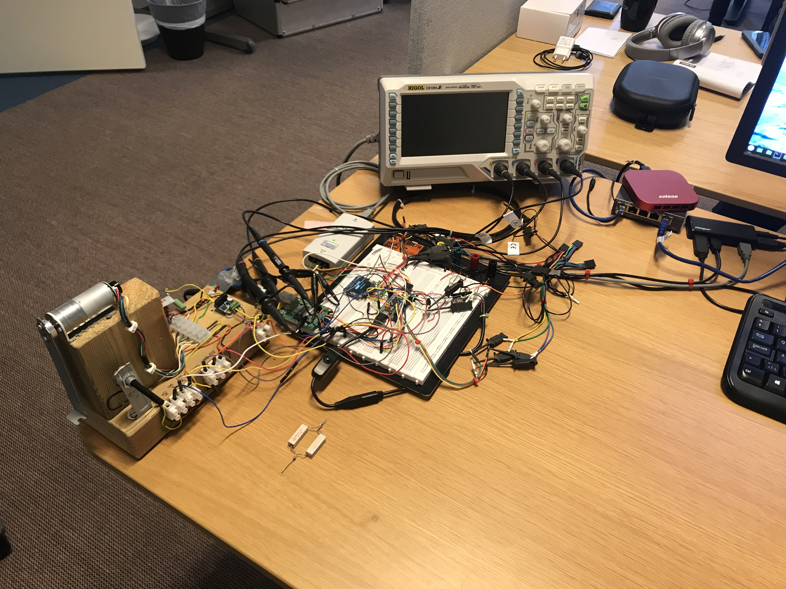

# stm32-bluepill


## General
Exploring the STM32 MCU with the "Blue Pill" STM32F103C8T6.



This repository includes different application projects based on [LibOpenCM3](https://libopencm3.org/) and [FreeRTOS](https://www.freertos.org/).<br/>

The layout and build structure was inspired by the contents found at:<br/>
https://github.com/libopencm3/libopencm3-template.git

## FreeRTOS
The use of FreeRTOS in the projects is described [here](FreeRTOS/README.md).<br/>
The use of FreeRTOS+TCP in the projects is described [here](FreeRTOS-Plus-TCP/README.md).<br/>

## Dependencies
All projects have been built and tested with:

* Linux Mint 19 Tara (x86_64)
* GNU Arm Embedded Toolchain, Version 9-2019-q4-major
* OpenOCD, 0.10.0
* SEGGER J-Link EDU, V6.55a
* SEGGER Ozone, V3.10g

## Build projects
Setup the environment:
```
> source ./scripts/setup_environment.sh
```
Build all projects, including libopencm3:
```
> make all
```
Build and manage an individual project:
```
> make -C blink_freertos clean
> make -C blink_freertos all
> make -C blink_freertos reset
> make -C blink_freertos flash
```
The reset and flash options will make use of OpenOCD and J-Link to control the target.

## Projects
The project folder (proj) includes applications that make use of various STM32 capabilities.

### blink
Simple 'hello word' application that blinks a LED and prints messages using the serial port (UART).

### blink_freertos
This variant of the *blink* project uses FreeRTOS and tasks.

### dcmotor_freertos
Control the position of a DC motor shaft using a PID controller and an external motor driver chip.

### enc28j60_freertos
Network communication (ping, UDP and TCP) with the FreeRTOS TCP/IP stack and an external Ethernet controller.

### irdecode_freertos
Test application for a driver that implements an IR decoder for the NEC Extended Prototcol.

### irgui_freertos
Use of LittlevGL in a FreeRTOS application that creates a GUI for presentation of decoded IR data.

### littlevgl_basic
Use of LittleVGL in an application that is NOT based on FreeRTOS to create the tasks that drives the GUI.

### ssd1306_freertos
Test application for a driver that controls a tiny OLED display and controller chip.

### stdio_freertos
The STDIO (libc-nano) functions requires the *_read* and *_write* functions. Connect these functions to use the UART.
